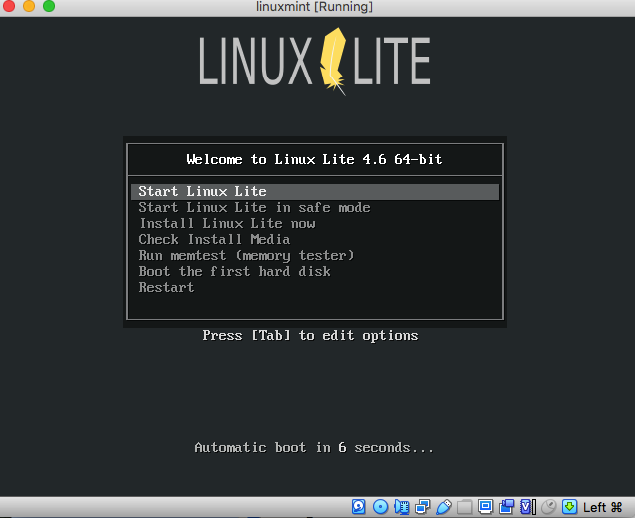
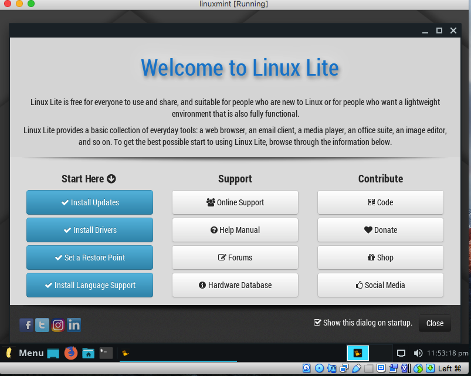
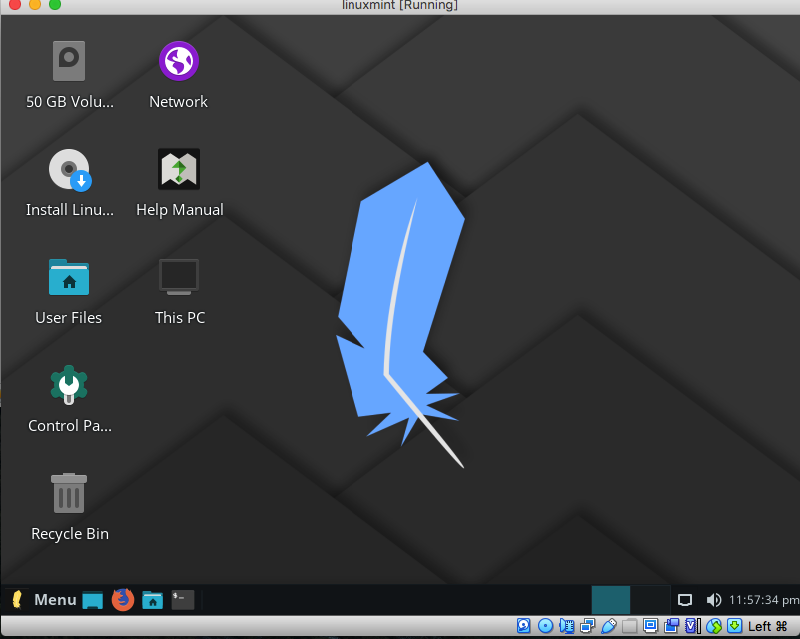
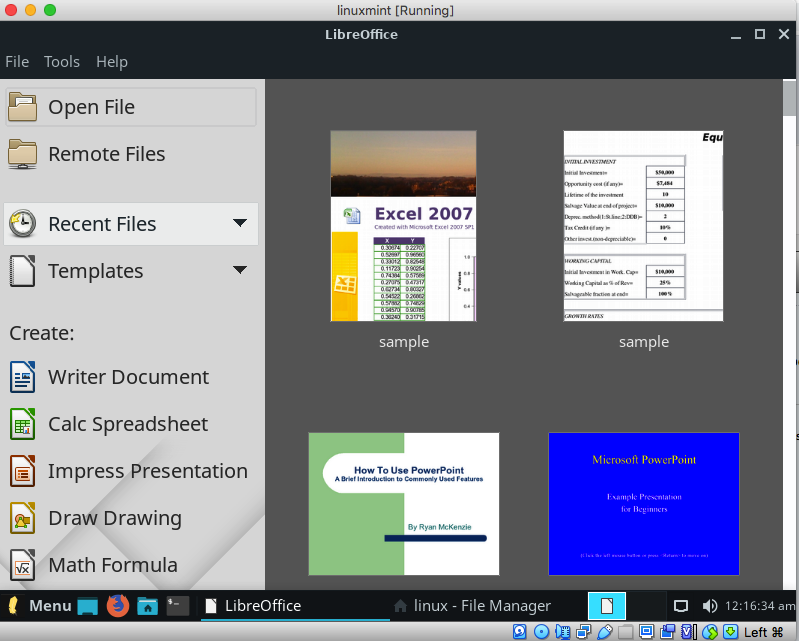
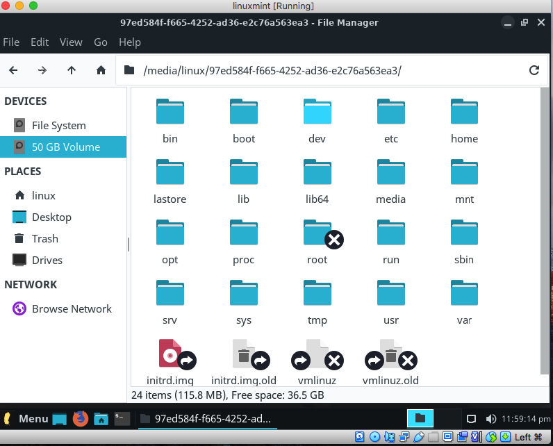
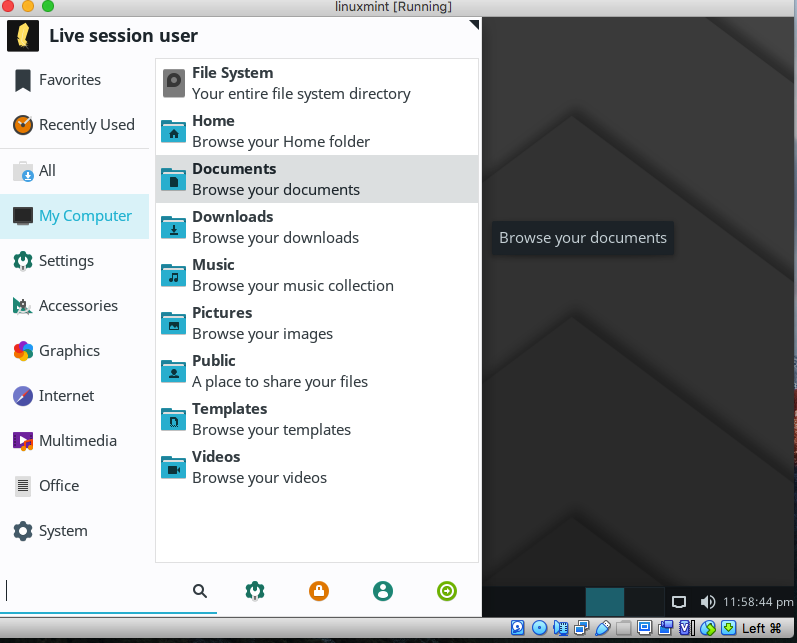
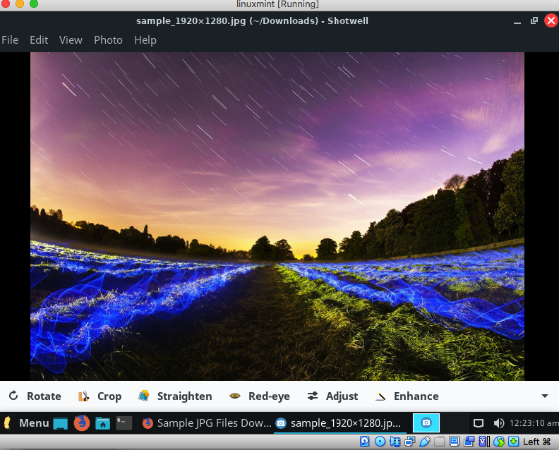
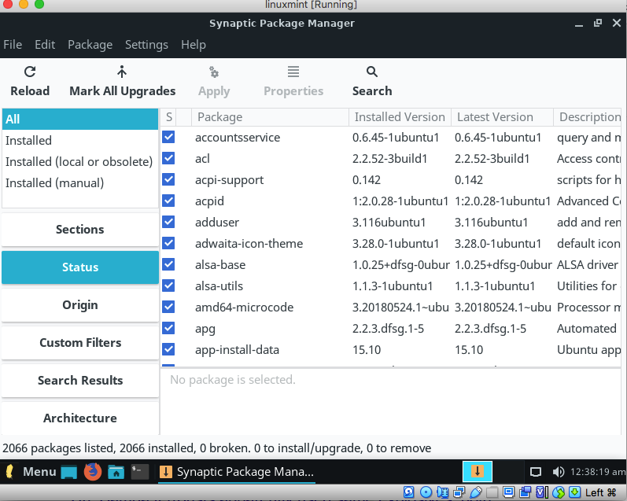
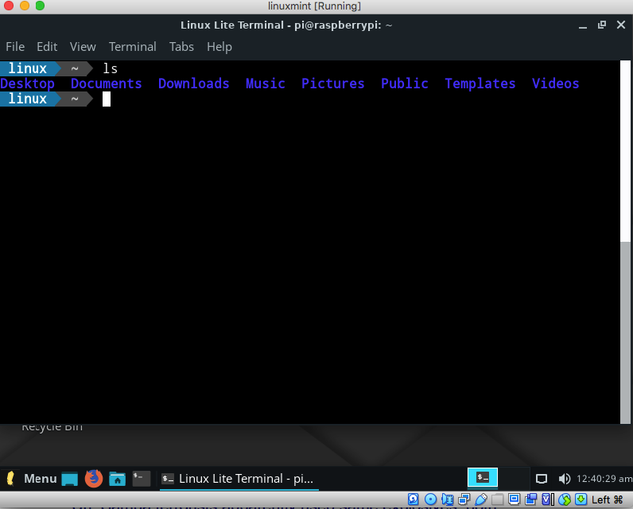
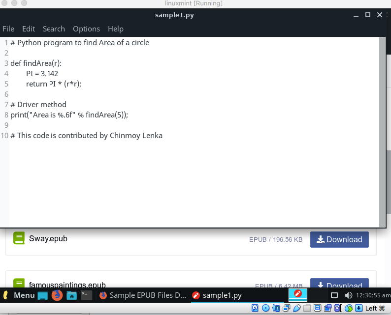

## Linux Lite - Best Alternative to Windows 7 for Old PC

### Background

I have tried Linux Lite earlier but never did an in-depth review of this Distro till now. Since I have posted on other Linux Distros I had always wanted to write about Linux Lite. I tried the LinuxLite 4.6 64bit for this demo.

### Introduction

Linux Lite is a Linux distribution, based on Debian and Ubuntu and created by a team led by Jerry Bezencon. The distribution offers a lightweight desktop experience with a customized Xfce desktop environment. It includes a set of Lite application to make the life easier for a novice Linux user. 

It has a very active community and after Zorin OS I find Linux Lite as the best light weight OS for your old PC. It is one of the few distributions that comes in 32 bit and 64 bit versions which makes sure that even your ancient PC is supported by Linux Lite.

### First Impressions

I had tried Linux lite on my old PC earlier, while I like it then but went with Zorin OS for its more modern and more simple looking UI but recently after using Lubuntu, I have come to appreciate the crisp and Windows friendly UI of  Linux Lite. 

Linux Lite is the closest UI that I have got to Windows 7 and also the most easiest to getting used to after coming from a Windows OS. Its UI is familiar, despite having a dark theme, its icon layout and start menu are the closest to Windows and the packaged apps like VLC Player, Libre Office, Gimp and Shotwell makes replaces the default Windows 7 App very well.

### The Good

For me the Desktop, the file manager and the Terminal are the highlight of LinuxLite. I have used many file managers and all try to emulate Windows File Browser to the best of their capability but the Linux Lite file browser has absolutely nailed it. 

As we spend most of the time on a Desktop on the UI, the simple, familiar layout and the Windows like Icons makes a Linux newbie easily at home. 

The other aspect which I liked in the VM was its out of box multimedia support and beautiful picture and audio quality which makes it a good alternatives for anyone looking to use Linux for personal use.

I also liked that for installing new packages they have Synaptic Package manager which makes the process of finding and installing new softwares and packages a breeze. 

It also has one of the best looking Terminals where I spend most of my time.

### Shortcomings

For me the Bad is lack of support for UEFI, this is one OS that I want to use on my low powered Laptop but because my laptop supports UEFI and for Linux Lite the UEFI is more of a hack and lack of ready ISOs makes it a very difficult choice to use out of a VM. As more and more UEFI supported devices become old, the demand for out of box for UEFI compatible Linux Distros will increase and its here that Zorin OS or Lubuntu outpace Linux Lite.   

Another area which I feel Linux Lite can improve is my supporting a developer friendly Text editor. While I can download Geany, Gvim, Gedit or VSCode, for a developer like me who uses out of box Linux distro for light development and compatible developed friendly text editor is a great help specifically for even a new Linux user. As a significant number of first time Linux users are developers.

### Final Thoughts

Finally I would say for me this is a distribution which I want to use as a daily driver simply because of the lovely dark theme and the simplicity of the Software and familiar interface it provides. Only if the process of enabling UEFI is simpler on LinuxLite , this will become my most recommended Linux distribution.